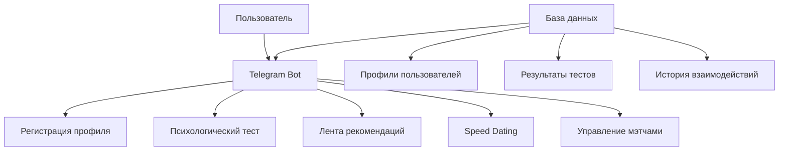
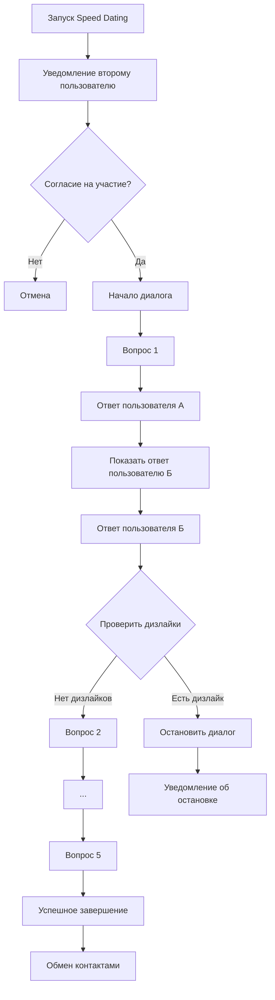
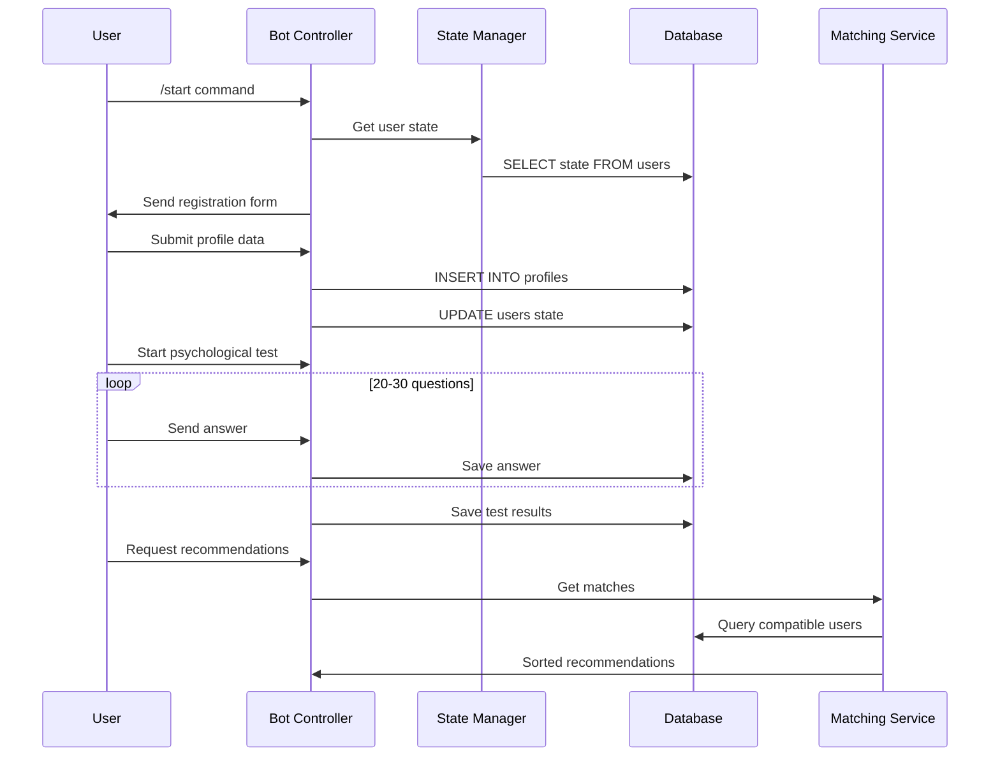

# Telegram-бот знакомств с психологическим тестом и Speed Dating

## 📋 Оглавление
- [Общее описание](#общее-описание)
- [Что видит пользователь](#что-видит-пользователь)
- [Архитектура системы](#архитектура-системы)
- [План разработки](#план-разработки)
- [Распределение задач](#распределение-задач)

## 🎯 Общее описание

Telegram-бот для знакомств с интеллектуальным подбором партнеров на основе психологической совместимости. Основные функции:

- **Регистрация профиля** с базовой информацией
- **Психологический тест** из 20-30 вопросов
- **Умные рекомендации** с процентом совместимости
- **Speed Dating** - 5-вопросное мини-знакомство
- **Обмен контактами** при успешном прохождении

## 👤 Что видит пользователь

### 2.1 Регистрация
- Команда `/start` → приветствие + кнопка "Заполнить профиль"
- Пошаговое заполнение: имя, возраст, город, пол, фото, никнейм
- Предложение пройти психологический тест

### 2.2 Психологический тест
- 20-30 утверждений с оценкой от 1 до 5
- Пример: "Мне легко знакомиться с новыми людьми"
- Результат: психологический портрет и готовность к рекомендациям

### 2.3 Лента рекомендаций
- Карточки пользователей: фото, имя, возраст, город, % совместимости
- Кнопки: ❤️ Лайк, ❌ Дизлайк

### 2.4 Speed Dating
- Уведомление о взаимном лайке
- 5 вопросов с поочередными ответами
- Возможность дизлайка в любой момент
- Обмен контактами при успешном завершении

## 🏗 Архитектура системы

### Общая структура системы

### Процесс Speed Dating

### Обработка запросов и БД

## 📅 План разработки (20 дней)

### Неделя 1: Базовая инфраструктура (5 дней)
**Дни 1-5:**
- Настройка проекта и окружения
- База данных и модели
- Базовый бот с FSM
- Система регистрации профиля

### Неделя 2: Основные функции (5 дней)
**Дни 6-10:**
- Психологический тест
- Алгоритм совместимости
- Лента рекомендаций
- Система лайков/дизлайков

### Неделя 3: Speed Dating (5 дней)
**Дни 11-15:**
- Механика приглашений
- Диалоговая система вопросов
- Управление сессиями
- Обмен контактами

### Неделя 4: Тестирование и доработки (5 дней)
**Дни 16-20:**
- Интеграционное тестирование
- Исправление багов
- Оптимизация алгоритмов
- Деплой и документация

## 👥 Распределение задач

### 🎯 Тимлид / ML-инженер

| Задача | Описание |
|--------|----------|
| Алгоритм совместимости | Психологический тест + подбор пар |
| Интеграция ML-моделей | Анализ ответов, расчет % совместимости |
| Тестирование системы | Интеграционные тесты, проверка работы |

### 💻 Backend-разработчик #1

| Задача | Описание |
|--------|----------|
| База данных и модели | PostgreSQL |
| Система регистрации | валидация, хранение профилей |
| Психологический тест | Вопросы, ответы, сохранение результатов |
| API и сервисный слой | REST API, бизнес-логика |
| Документация | API docs, setup инструкции |

### 💻 Backend-разработчик #2

| Задача | Описание |
|--------|----------|
| Telegram Bot Core | Настройка бота |
| Лента рекомендаций | Карточки пользователей |
| Система лайков/мэтчей | Взаимные лайки, уведомления |
| Speed Dating механика | Диалоги, вопросы, управление сессиями |
| Обработка ошибок | Валидация, исключения, retry логика |

*Срок выполнения: 20 дней*
*Команда: 3 человека* 
*Версия: 1.0*
